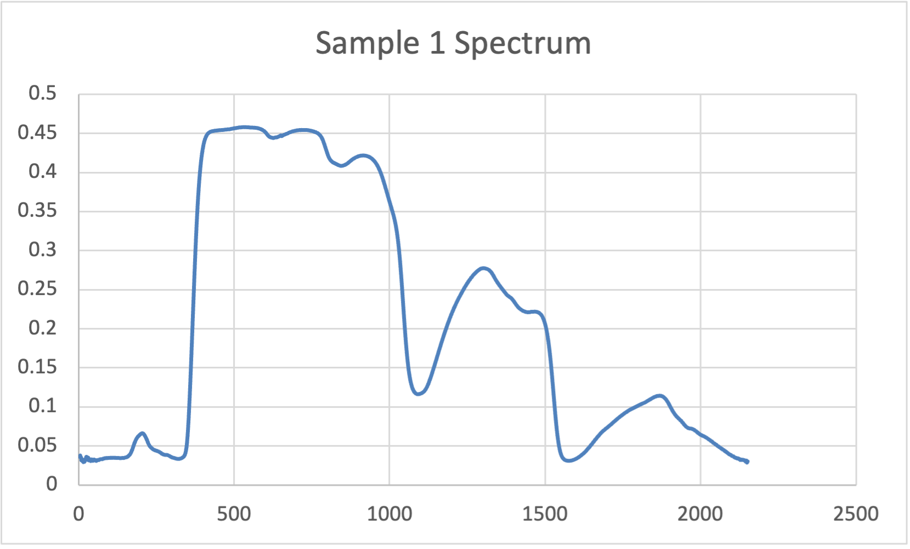
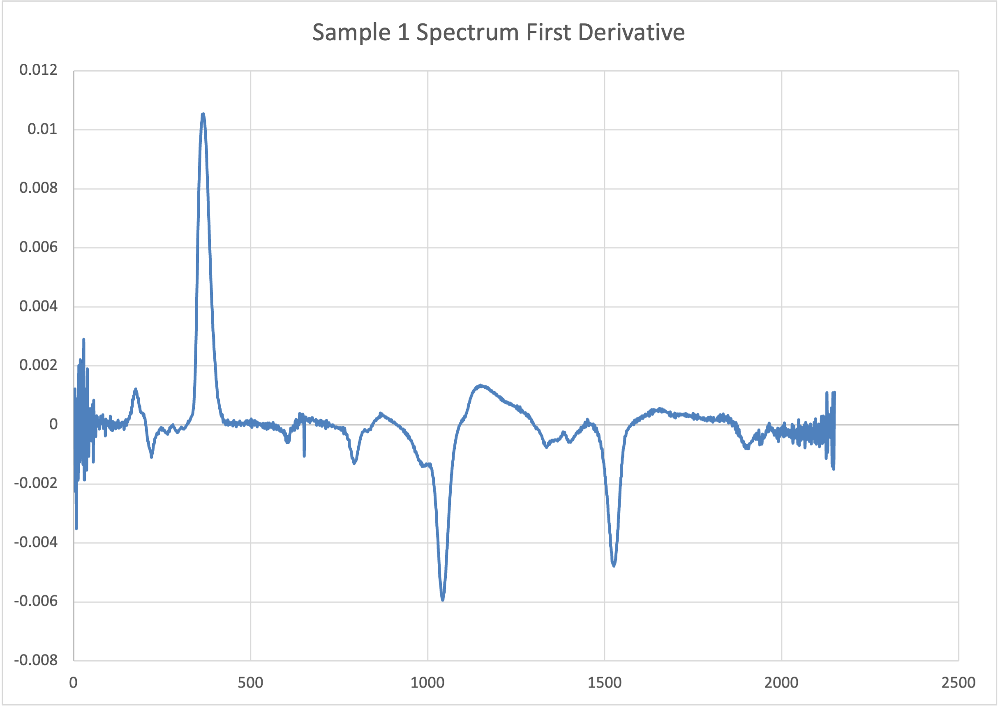
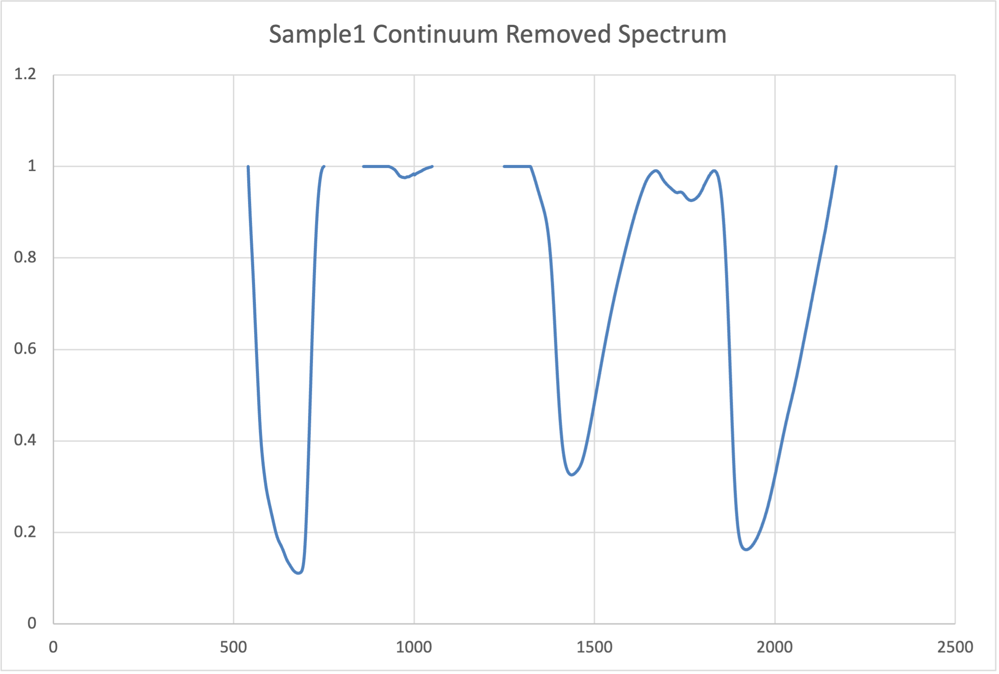
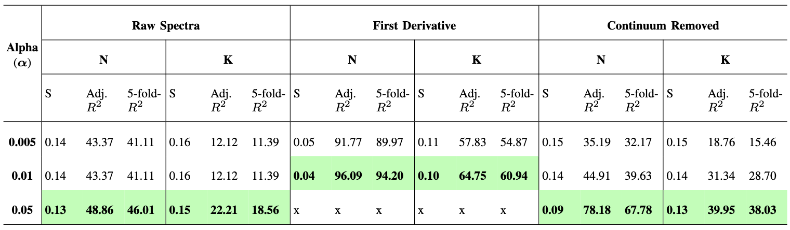

# Foliar Biochemistry Modeling using Non-Invasive Hyperspectral Methods  

## Overview  
This study explores the use of **hyperspectral data** for estimating **Nitrogen (N)** and **Potassium (K)** concentrations in crop foliage using a **stepwise linear regression model**. We evaluate different spectral preprocessing techniques:  
- **Raw Spectra:** Direct reflectance values from hyperspectral measurements.  
- **First Derivative Spectra:** Enhances subtle spectral variations and improves feature separability.  
- **Continuum-Removed Spectra:** Highlights absorption features by normalizing reflectance curves.  

  
  
  

*Figure: Examples of the three spectral preprocessing techniques used in this study.*  

The objective is to determine the most effective spectral transformation and key predictive wavelengths for foliar nutrient estimation.

## Methodology  
We analyzed **92 crop samples** with hyperspectral data ranging from **350 nm to 2500 nm** at **1 nm resolution**. To improve predictive accuracy, we applied **stepwise linear regression** with varying **alpha-to-enter** thresholds (**0.005, 0.01, and 0.05**). The model was evaluated using:  
- **Adjusted \(R^2\):** Measures goodness of fit.  
- **Standard Error (S):** Assesses prediction accuracy.  
- **5-fold Cross-Validation \(R^2\):** Tests model generalizability.  

## Results  
Model performance varied based on spectral preprocessing:  
- **First Derivative Spectra** yielded the highest accuracy at **α = 0.01**, with **adjusted \(R^2 = 96.09\%\) for N** and **\(R^2 = 64.75\%\) for K**, due to enhanced feature separability.  
- **Continuum-Removed Spectra** performed well for **N estimation**, achieving **\(R^2 = 78.18\%\) at α = 0.05**, as it effectively isolates biochemical absorption features.  
- **Raw Spectra** had the lowest predictive power but still captured key spectral regions relevant to nutrient estimation.  

The most informative spectral bands were identified in:  
- **UV (360–450 nm) and Red-Edge (600–750 nm):** Associated with chlorophyll absorption.  
- **NIR (800–1300 nm):** Reflects structural and biochemical variations in leaves.  
- **SWIR (1900–2500 nm):** Correlated with lignin, cellulose, and water absorption features.  

  

*Figure: Performance comparison of regression models across different spectral transformations.*  

## Conclusion  
This study highlights the **importance of spectral preprocessing** for improving foliar nutrient estimation. The **first derivative transformation** emerged as the most effective, enhancing subtle spectral variations critical for **N and K prediction**. The findings reinforce the **potential of hyperspectral data** for precision agriculture and non-invasive nutrient monitoring. Future work will focus on field-based hyperspectral imaging and advanced modeling techniques.
  
This work has been done on [Minitab](https://www.minitab.com/en-us/) statistical software. All the description and results are included in documentation file `Foliar_Biochemistry.pdf`

### Acknowledgments
Special thanks to [Dr. Jan van Aardt](https://www.rit.edu/directory/jvacis-jan-van-aardt) for providing guidance and resources for this work.
