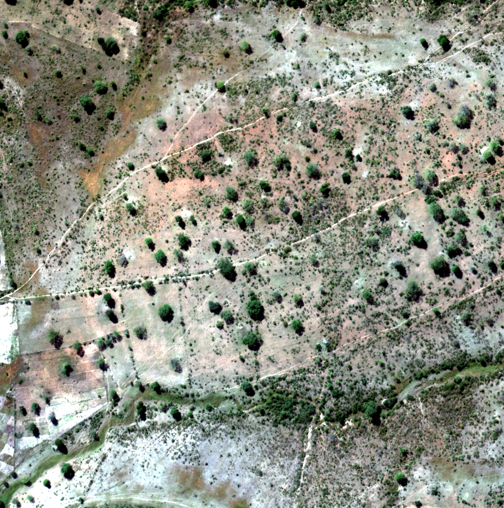
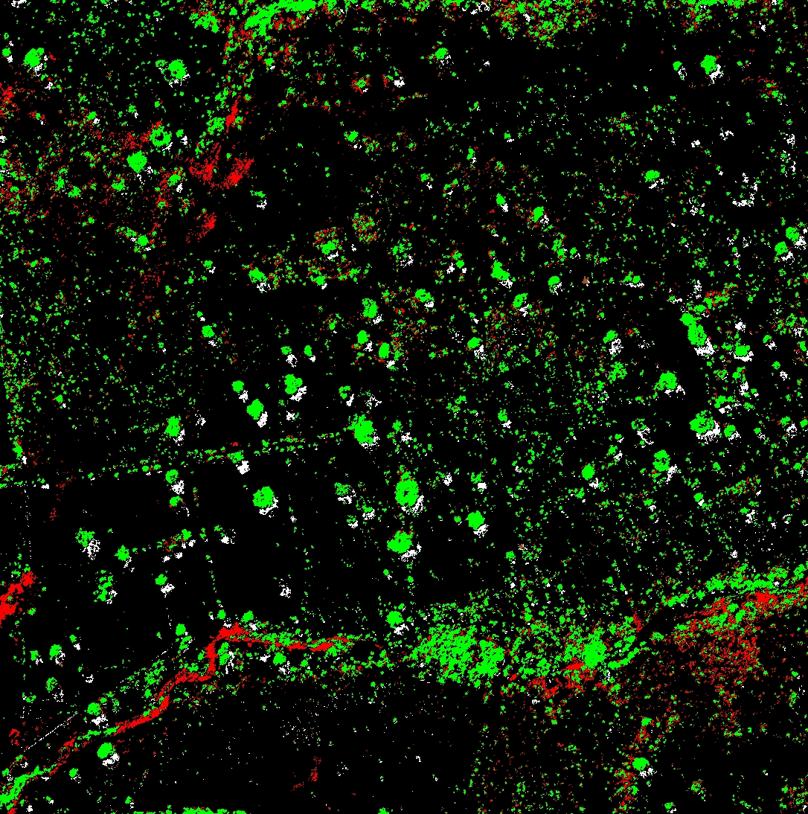
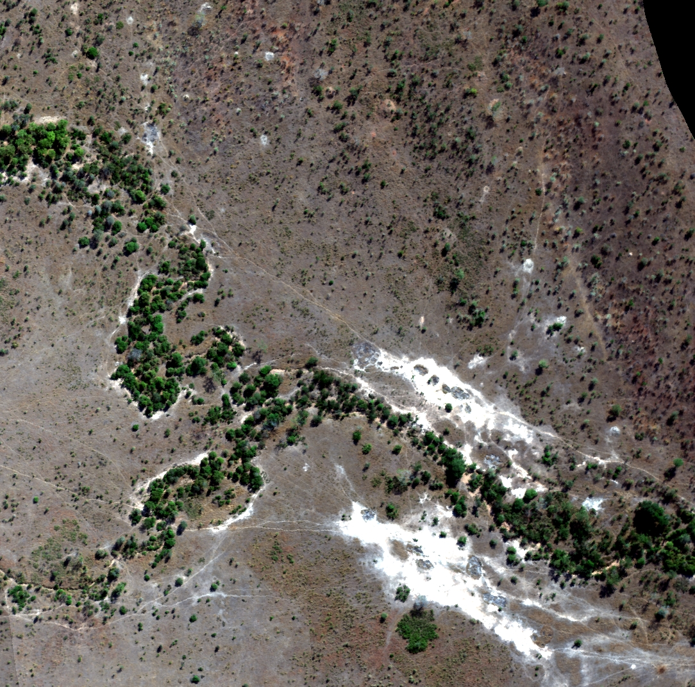
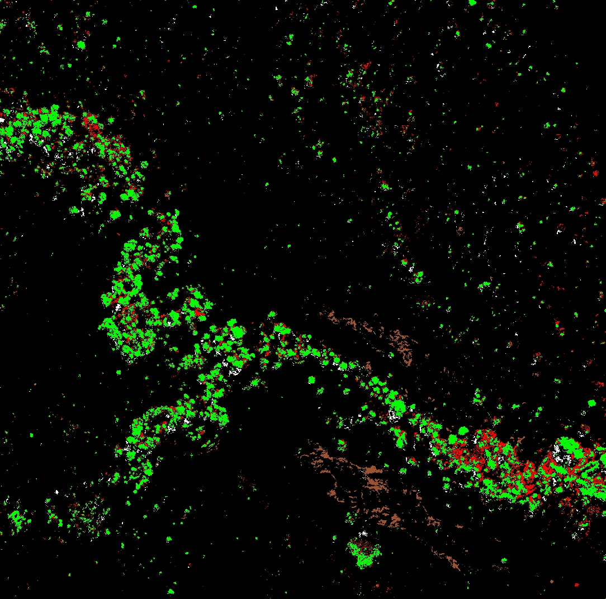

# Land Degradation Assessment using Hyperspectral Imagery

## Overview
This project analyzes land degradation in a savanna environment using hyperspectral imagery from the Carnegie Airborne Observatory. It compares conserved (Kruger National Park) and degraded (communal lands) regions in South Africa, leveraging spectral analysis techniques to classify land cover types.

## Dataset
- **Source:** Carnegie Airborne Observatory
- **Coverage:** Kruger National Park (Conserved) & Communal Lands (Degraded)
- **Spectral Range:** 24 bands from visible (394.3 nm) to near-infrared (1044.9 nm)

## Methodology
1. **Preprocessing:**
   - Minimum Noise Fraction (MNF) for dimensionality reduction
   - Pixel Purity Index (PPI) for endmember selection
2. **Classification:**
   - Spectral Angle Mapper (SAM)
   - Linear unmixing for abundance maps
3. **Land Cover Categories:**
   - Photosynthetic Vegetation (PV)
   - Non-photosynthetic Vegetation (NPV)
   - Bare Soil (BS)
   - Shadow (S)
4. **Accuracy Assessment:**
   - Stratified sampling (10 samples per class)
   - Confusion matrix for classification evaluation

## Results
- **Key Findings:**
  - Degraded areas exhibit higher bare soil cover and lower NPV compared to conserved regions.
  - PV distribution is more uniform in the conserved region, while it is clustered along water sources in degraded lands.
  - Classification achieved high accuracy, with PV having the best producer’s accuracy (90%-100%) and NPV facing the most misclassification issues.

### Classified Map

  
  
  
  

<strong>Figure:</strong> 

## License
This project is licensed under the MIT License - see the [LICENSE](LICENSE) file for details.

