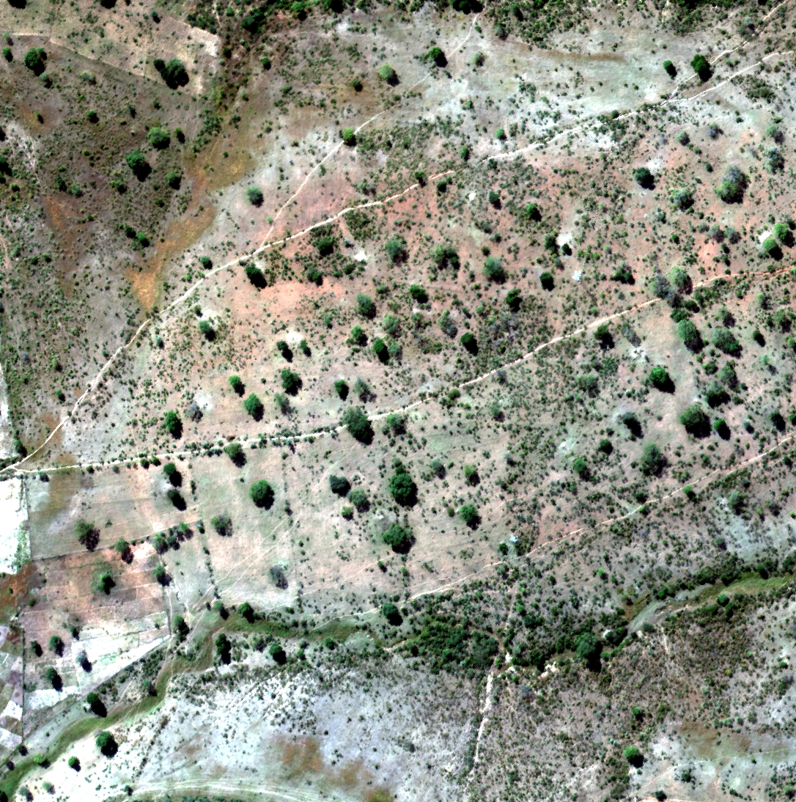
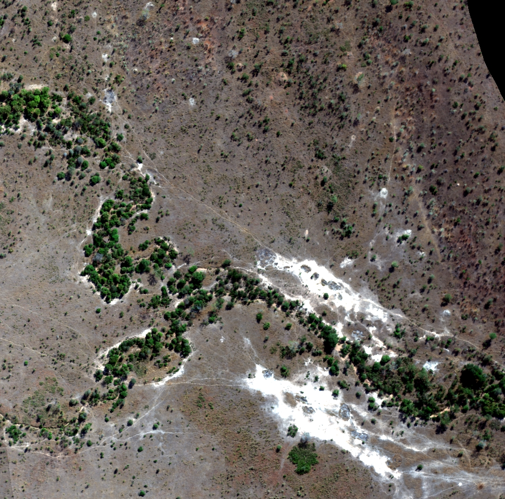
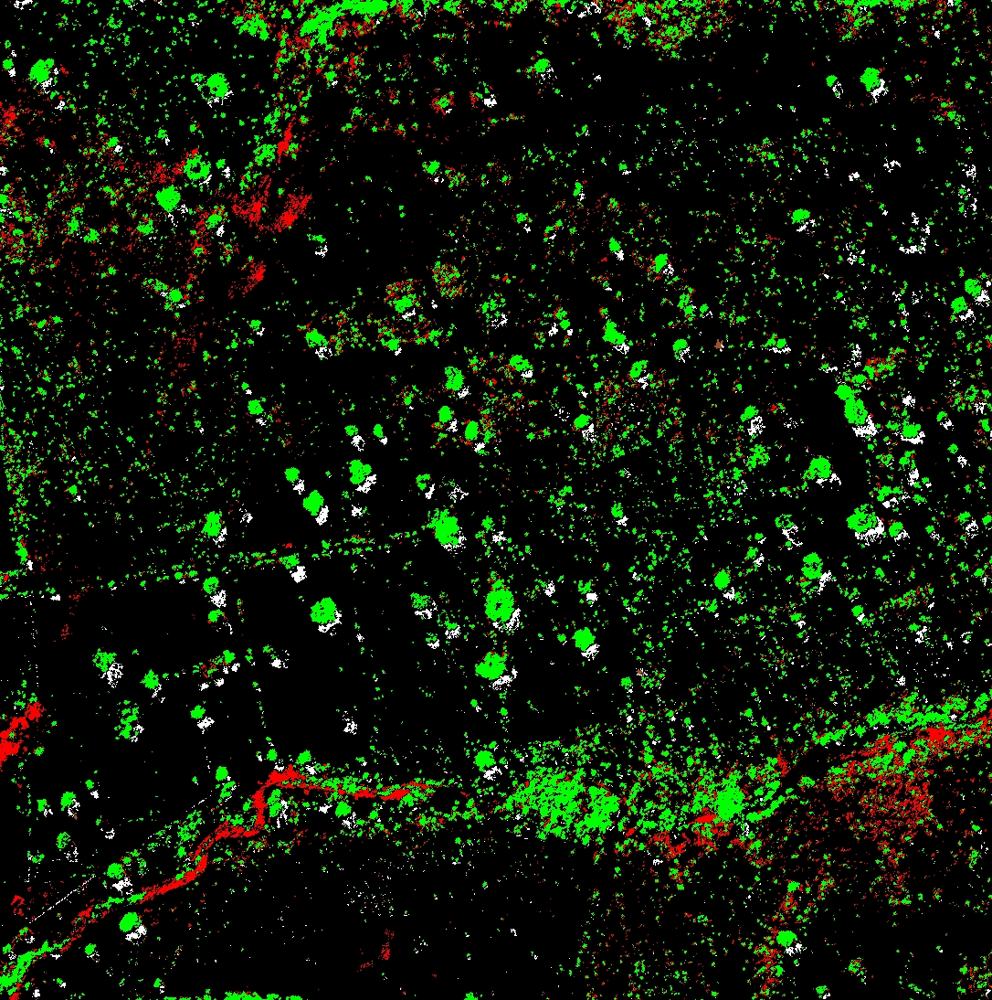
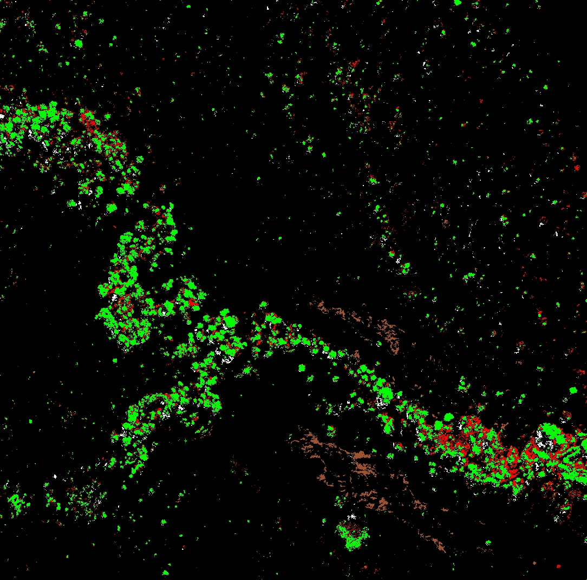

# Land Degradation Assessment using Hyperspectral Imagery

## Overview
This project analyzes land degradation in a savanna environment using hyperspectral imagery from the Carnegie Airborne Observatory. It compares conserved (Kruger National Park) and degraded (communal lands) regions in South Africa, leveraging spectral analysis techniques to classify land cover types.

## Dataset
- **Source:** Carnegie Airborne Observatory
- **Coverage:** Kruger National Park (Conserved) & Communal Lands (Degraded)
- **Spectral Range:** 24 bands from visible (394.3 nm) to near-infrared (1044.9 nm)

## Methodology
1. **Preprocessing:**
   - Minimum Noise Fraction (MNF) for dimensionality reduction
   - Pixel Purity Index (PPI) for endmember selection
2. **Classification:**
   - Spectral Angle Mapper (SAM)
   - Linear unmixing for abundance maps
3. **Land Cover Categories:**
   - Photosynthetic Vegetation (PV)
   - Non-photosynthetic Vegetation (NPV)
   - Bare Soil (BS)
   - Shadow (S)
4. **Accuracy Assessment:**
   - Stratified sampling (10 samples per class)
   - Confusion matrix for classification evaluation

## Results
- **Key Findings:**
  - Degraded areas exhibit higher NPV compared to conserved regions.
  - PV distribution is more dense in the conserved region, while it is sparsely distributed in degraded lands.
  - Classification achieved high accuracy, with PV having the best producer’s accuracy (90%-100%) and NPV facing the most misclassification issues.

### Classified Map

  
  
  
  

<strong>Figure:</strong>Top Left) RGB Image of Degraded Area, (Top Right) RGB Image of Conserved Area , (Bottom Left) SAM Classified Degraded Area  , (Bottom Right) SAM Classified Conserved Area  Classes: Green = PV, Red = NPV, Brown = Bare Soil, White = Shadow, and Black = Unclassified.

### Comment 
A simple Spectral Mapping (SAM) algorithm is used to classify the imagery into 4 classes- PV (photosynthetic vegetation), NPV (Non-photosynthetic vegetation), BS (Bare Soil) and Shadow areas (S). Visually comparing- among classified pixels PV, NPV and Shadow classes are dominant in landuse-7 (degraded) case while PV and BS class are dominant in landuse-2 (conserved) case. So landuse-2 has higher proportion of Bare Soil pixels while landuse-7 have higher level of NPV. This can be attributed to the degradation of land which make it unfit for vegetation growth in case of landuse-7 which reflects in higher NPV levels. Again the distribution of PV is concentrated in central area of the scene while most of the area is unclassified in case of landuse-2 case, however the distribution of PV in case of landuse-7 case is sparse and uniform across the scene. This might be because we took the endmembers from degraded areas and used them for classifying conserved areas, thus the algorithm couldnt find relevant match for given threshold in conserved area and more area is unclassified.

This work has been done on [ENVI](https://www.nv5geospatialsoftware.com/Products/ENVI) Remote Sensing Software for Image Processing and Analysis. All the description and results are included in documentation file `Report_Land_degradation.pdf`

### Acknowledgments
Special thanks to [Dr. Jan van Aardt](https://www.rit.edu/directory/jvacis-jan-van-aardt) for providing guidance and resources for this work.

