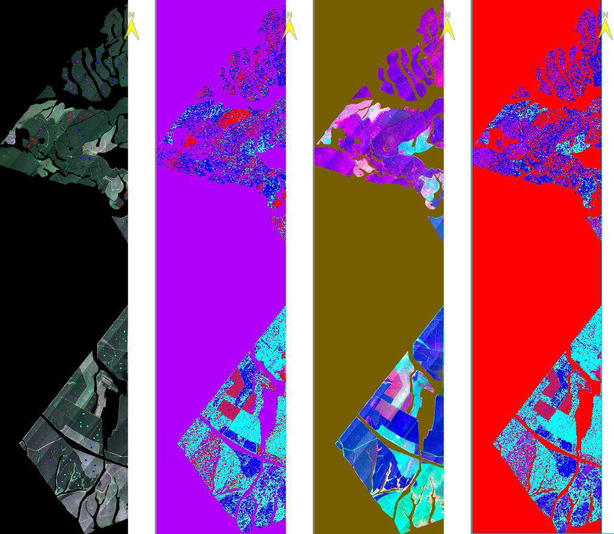

# Forest Species Classification using HSI

### Overview
Tree species classification is crucial for ecological studies and sustainable forest management. This project explores **Hyperspectral Imaging (HSI)** data from the **Compact Airborne Spectrographic Imager (CASI)**, which captures spectral responses in 36 bands. The classification is performed using **Maximum Likelihood Estimation (MLE)** and **Spectral Angle Mapper (SAM)** to evaluate their performance on raw and transformed data.

### Dataset
- **Classes:**
  - `Eucalyptus grandis (Gran)`
  - `Eucalyptus dunnii (Dun)`
  - `Eucalyptus grandis x nitens (GraNit)`
  - `Acacia mearnsii (Amea)`
  - `OtherTree`
  - `Bare Soil (BS)`
- **Data Source:** Hyperspectral airborne imagery
- **Method:** Minimum Noise Fraction (MNF) transformation for dimensionality reduction

### Workflow
```
1. Preprocess raw hyperspectral data (radiometric and geometric corrections)
2. Apply MNF transformation to reduce data dimensionality
3. Train classifiers (MLE, SAM) on both raw and MNF-transformed bands
4. Evaluate classification accuracy using standard metrics
```
### Result Overview

*Figure: Classification results: From left to right—Raw data with training samples, classified image using raw data, MNF-reduced
data (first 3 bands), and classified image using MNF-reduced data. (Classes- Blue: Gran (Eucalyptus grandis), Red: GraNit (Eucalyptus grandis x nitens), cyan: BS (Bare Soil), Teal: Dun (Eucalyptus dunnii), Pastel-Red: Amea (Acacia mearnsii))*

This work has been done on [ENVI](https://www.nv5geospatialsoftware.com/Products/ENVI) Remote Sensing Software for Image Processing and Analysis. All the description and results are included in documentation file `Documentation.pdf`

### Acknowledgments
Special thanks to [Dr. Jan van Aardt](https://www.rit.edu/directory/jvacis-jan-van-aardt) for providing guidance and resources for this work.
